<picture>
  <source media="(prefers-color-scheme: dark)" srcset="./profile-dark-v5.svg">
  <source media="(prefers-color-scheme: light)" srcset="./profile-light-v5.svg">
  
</picture>

### What I'd like to build next

- Small embedded projects that collect and process sensor data.
- Wearable prototypes with useful feedback from those sensors.
- Security experiments focused on device communication and firmware.

### Contact

[GitHub](https://github.com/mrbera88) · [LinkedIn](https://www.linkedin.com/in/berauzun/) · [Email](mailto:berauzun173@gmail.com)
